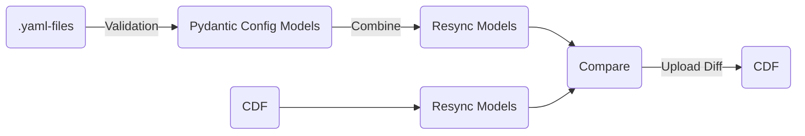

## What is `resync`?

`resync` is a tool for syncing configuration files with CDF.

## Why `resync`?

The problem `resync` is solving is to have confidence through traceability and reproducibility of the configuration
files used to create the resources in CDF. The user interface is inspired by `terraform` with `init`, `validate`, `plan`, `apply`, `destroy`
commands. The `plan` command will compare CDF with the local configuration files and output the changes that will be
applied if the `apply` command is run. The `apply` command will apply the changes to CDF. `resync` is intended to be
run in a CI/CD pipeline, but can also be run locally.

The alternative to using `resync` is to manually create the resources in CDF, and/or have custom scripts
residing on different developers local computers. This is error prone and does not provide
traceability and reproducibility.

## How does `resync` work?

## Main `resync` functions

::: cognite.powerops.resync.init

::: cognite.powerops.resync.validate

::: cognite.powerops.resync.plan

::: cognite.powerops.resync.apply

::: cognite.powerops.resync.destroy
